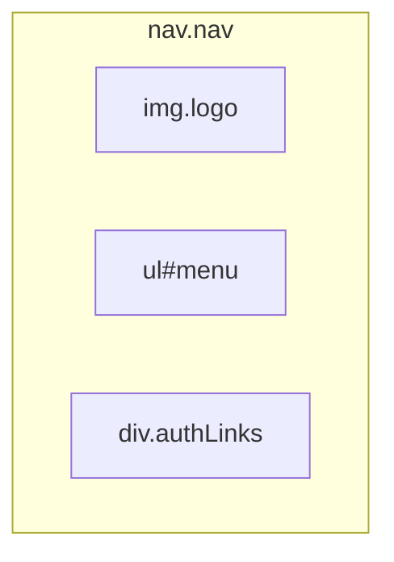
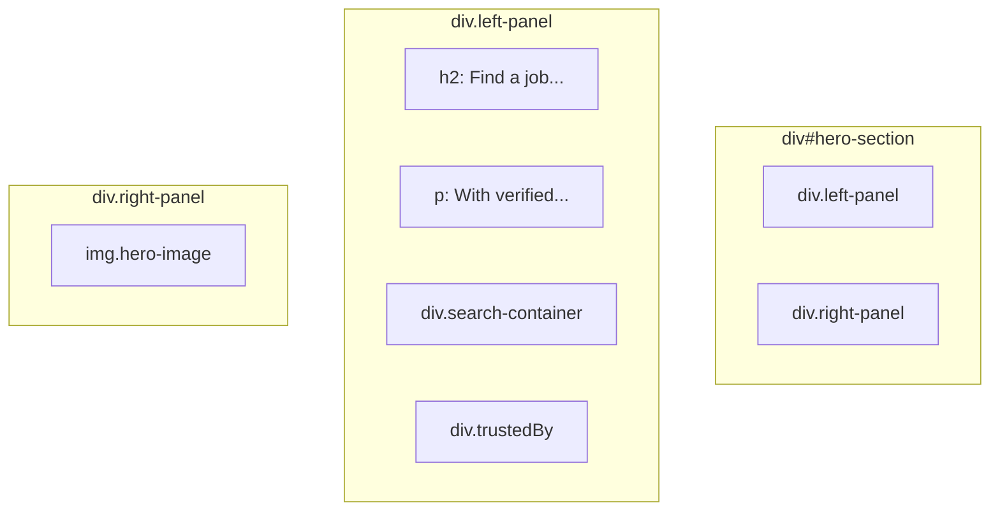

# Website Redesign Plan

This document outlines the plan to redesign the website's header and hero section to match the provided image.

## Part 1: Restructure HTML (JSX) in `Header.js`

The existing HTML structure will be updated to support the new, more complex layout.

### 1. Navigation Bar

The `<nav>` element will be restructured to have three distinct children for a "left-center-right" alignment.

- **Logo:** An `` tag on the left.
- **Menu:** A `<ul id="menu">` in the center.
- **Auth Links:** A `<div className="authLinks">` on the right, with the "Log In" link getting a unique ID for button styling.



### 2. Hero Section

The main content area will be replaced by a new `<div id="hero-section">` containing two panels.

- **Left Panel (`<div className="left-panel">`):** This will contain all text-based content, including the heading, paragraph, search bar, and "Trusted by" logos. It will have a rounded, light-green background.
- **Right Panel (`<div className="right-panel">`):** This will hold the main hero image.



## Part 2: Update CSS in `Banner.css`

The CSS will be rewritten to style the new structure, using Flexbox for layout and adding specific styles for colors, borders, and spacing.

### 1. Navigation Styling

- **`.nav`:** Will use `display: flex` and `justify-content: space-between` to position the three navigation elements correctly.
- **`#login`:** Will be styled with a light green background, rounded corners, and padding to appear as a button.

### 2. Hero Section Styling

- **`#hero-section`:** Will be a flex container to place the left and right panels side-by-side.
- **`.left-panel`:** Will have a `background-color`, `border-radius`, and `padding` to create the distinct panel effect.
- **`.right-panel`:** Will correctly contain the hero image.
- **Hero Image:** The image itself will receive a `border-radius` and a thin green `border`.
- **Search Bar:** The search input and button will be styled to match the modern, rounded look from the image.

---

# Recommended Jobs Section Refactor Plan

This document outlines the plan to refactor and build the "Recommended Jobs" section to match the provided design.

## The Strategy: Modular Components

The current implementation will be refactored into a more modular and reusable structure. This involves creating a dedicated `JobCard` component for individual listings and a `RecommendedJobs` container component to manage the entire section.

### 1. Rename `RecommendedJobs.js` to `JobCard.js`

The existing `RecommendedJobs.js` component will be repurposed to represent a single job card.

- **Action:**
    1.  Rename the file `dashboard/src/component/RecommendedJobs.js` to `dashboard/src/component/JobCard.js`.
    2.  Rename the function inside from `RecommendedJobs` to `JobCard`.
    3.  Update the component's props to include `jobType`, `companyLogo`, `jobTitle`, `companyName`, and `location`.
    4.  Rewrite the JSX inside `JobCard.js` to match the detailed structure of a single card from the design.

### 2. Create a New `RecommendedJobs.js` Container

A new `RecommendedJobs.js` component will be created to act as a container for the entire section.

- **Action:**
    1.  Create a new file: `dashboard/src/component/RecommendedJobs.js`.
    2.  This component will be responsible for the `<h2>Recommended Jobs</h2>` title.
    3.  It will manage a list of job data (as an array of objects).
    4.  It will map over this data and render a `JobCard` for each job.
    5.  It will include the left and right navigation arrows.

### 3. Update `App.js`

`App.js` will be simplified to render the new, self-contained `RecommendedJobs` component.

- **Action:**
    1.  Remove the hardcoded job data and the `.recommendedJobs` div from `App.js`.
    2.  Render the `<RecommendedJobs />` component in its place.

### 4. Update the CSS in `JobCard.css`

The stylesheet will be updated to style the new, more detailed structure of the `JobCard` and the layout of the `RecommendedJobs` container.

- **Action:**
    1.  Style the main section container, title, and navigation arrows.
    2.  Use CSS Grid or Flexbox to create the responsive grid of job cards.
    3.  Style each `.job-card` with the correct background, padding, border, and box-shadow.
    4.  Style the internal elements: job type tag, company logo, job title, separator line, location info, and the "Apply now" button.

### Component Structure Diagram

```mermaid
graph TD
    A[App.js] --> B[RecommendedJobs.js];
    subgraph RecommendedJobs.js (Container)
        C[h2: Recommended Jobs]
        D[div.job-cards-grid]
        E[div.nav-arrows]
    end
    B --> C & D & E;
    D -- "maps over jobData" --> F[JobCard.js];
    D --> G[JobCard.js];
    D --> H[JobCard.js];
    
    subgraph JobCard.js (Presentational)
        I[div.job-type-tag]
        J[img.company-logo]
        K[h3.job-title]
        L[hr.separator]
        M[div.company-info]
        N[a.apply-now-btn]
    end
```

---

# "How It Works" Section Implementation Plan

This document outlines the plan to build the "How It Works" section to match the provided design.

## The Strategy: A Two-Column Layout

The component will be structured as a two-column layout, with a grid of images on the left and descriptive text on the right.

### 1. Restructure the JSX in `HowItWorks.js`

The existing JSX will be rebuilt to have two main child containers.

- **`.image-panel`:** This will contain the three image cards, arranged in the specific staggered layout from the design.
- **`.text-panel`:** This will hold the main title, the introductory paragraph, and the three feature descriptions, each with a checkmark icon.

### 2. Update the CSS in `HowItWorks.css`

The stylesheet will be rewritten to create the two-column layout and apply the specific styling from the design.

- **`.how-it-works-section`:** Will use `display: flex` to position the image and text panels side-by-side.
- **`.image-panel`:** Will use Flexbox and margins to create the staggered image grid.
- **`.text-panel`:** Will be styled with the correct font sizes and colors.
- **Checkmark Icons:** A style will be created for the green, circular checkmark icons.

### Component Structure Diagram

```mermaid
graph TD
    A[div.how-it-works-section] -- "display: flex" --> B[div.image-panel];
    A --> C[div.text-panel];

    subgraph div.image-panel
        D[div.image-card.top-left]
        E[div.image-card.middle-right]
        F[div.image-card.bottom-left]
    end

    subgraph div.text-panel
        G[h2: How it works]
        H[p: Getajob helps you...]
        I[div.feature-item]
        J[div.feature-item]
        K[div.feature-item]
    end

    subgraph div.feature-item
        L[img.checkmark-icon]
        M[div.feature-text]
    end